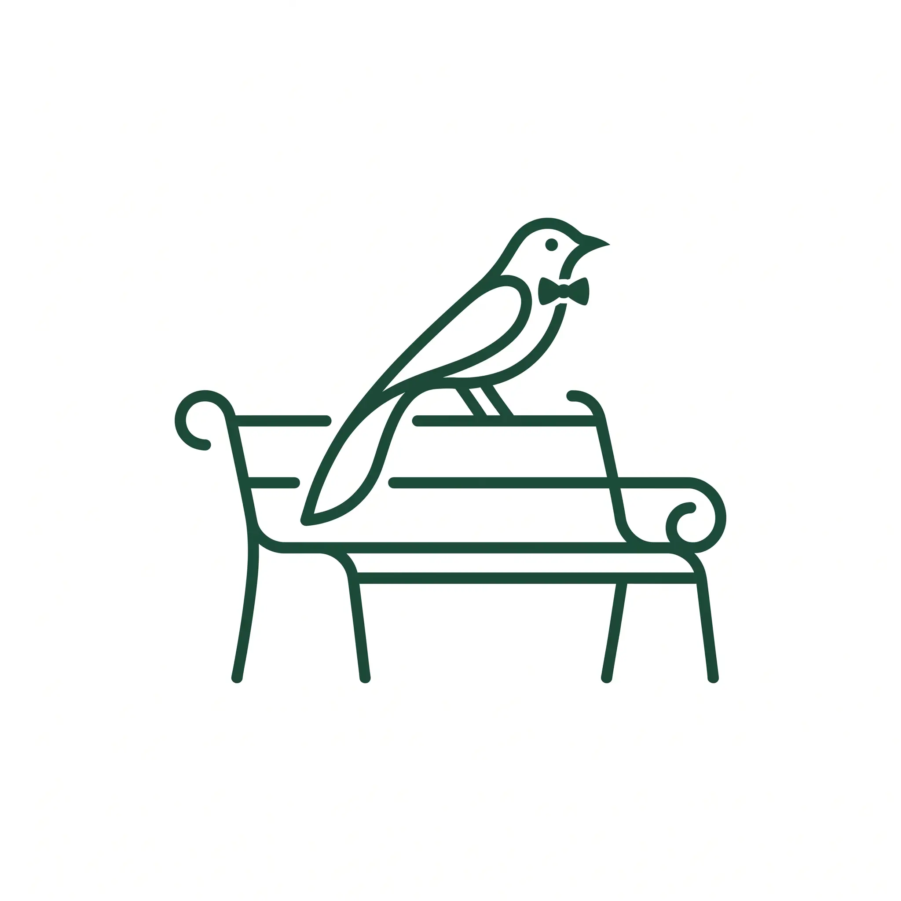

<div align="center">



# Perch

**Somebody already found the good spot.**

A shared map of places worth stopping — a bench with the whole city in it,
a flat rock above the cloud. Someone marks it with a photo or a short video,
and everyone else gets to sit there too.

</div>

---

## What this is

A mobile app, first. You open the map, see the spots people near you have
marked, walk to one, and mark your own with a photo. Follow the people whose
taste you trust and their finds show up in your feed.

Benches are where it started, but a rock ledge on a ridge is a perch too, and
hikers care about those more than park furniture. Five kinds of spot:
**bench, viewpoint, trail rest, picnic table, shelter**.

Read [`docs/STRATEGY.md`](docs/STRATEGY.md) before adding a feature — it
records what the idea was pressure-tested against, and which risks are being
carried deliberately.

## Layout

This is an npm workspace with two apps over one shared core.

```
apps/mobile      Expo / React Native — the product
apps/web         Next.js — marketing site + a browsable web map
packages/core    Domain types and the brand tokens both apps read from
supabase/        Postgres + PostGIS schema, RLS, storage buckets
scripts/         OSM seeding, icon generation
design/          Standalone landing page preview, logo studies
docs/            Strategy, roadmap, brand
```

`packages/core` is the single source of truth for the palette and type scale.
The web mirrors it as CSS custom properties in `apps/web/app/globals.css`;
change one, change the other.

## Getting started

```bash
npm install
cp .env.example .env.local
```

Create a Supabase project and paste its URL and keys in. Then apply the schema
— PostGIS, RLS, the counter triggers and the `spots_nearby` lookup all live in
one migration:

```bash
npm run db:push
```

Seed one area's spots from OpenStreetMap. **One.** Seeding the world is the
mistake that makes everywhere equally empty:

```bash
npm run seed:osm
```

Seeded spots arrive as *hollow pins* — open data knows a bench exists, it does
not know whether it is any good. They fill in as people mark them.

### Run the app

```bash
npm run mobile
```

Then press `i` or `a`, or scan the QR code with Expo Go. The app runs against
sample marks until Supabase env vars are set, so it is explorable immediately.

### Run the site

```bash
npm run web
```

Landing page at `/`, web map at `/map`.

## Icons

Every icon — iOS, Android adaptive, splash, favicon — is generated from the one
transparent master at `apps/web/public/logo.png`:

```bash
npm run icons
```

## The data model

| | |
|---|---|
| **spots** | a place worth stopping. Position, kind, attributes |
| **marks** | one person's photo or video of stopping there |
| **saves** | somebody else wanting to go |
| **follows** | whose finds land in your feed |

Media lives on the **mark**, never on the spot, and it is required. A spot
without a picture is just a pin, and pins are the part open data already has.

## Attribution

Base map data © [OpenStreetMap](https://www.openstreetmap.org/copyright)
contributors, licensed **ODbL**. Attribution is a licence condition, not a
courtesy — it stays visible in both apps.

## Licence

MIT — see [LICENSE](LICENSE). The MIT licence covers this source code only;
seeded map data remains under ODbL.
